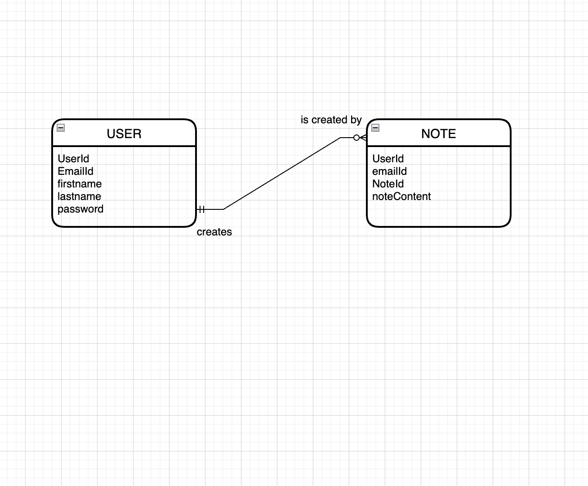

# Heading Note Taking Application

This application is used to create notes.There are 3 main pages. register page, home page and note creation page. New Users can register in the registration page with their firstname, lastname, email id and password.

# Languages used
HTML, CSS, JS, Node and express.

HTML is the standard markup language for creating Web pages.

CSS is the language we use to style a Web page.

# Node.js
Node.js (also referred to as just Node) is not a language, is not a
library, is not a framework; It is a runtime environment. A runtime
environment is the environment in which a program or application
is executed.

▸ Node.js runs the V8 JavaScript engine; This is what powers Google
Chrome. It's the thing that takes our JavaScript and executes it while
browsing with Chrome.

▸ Node is fast, single threaded, event driven and non-blocking. Some
will argue Node is actually multi-threaded, but I’m not going into
that. It’s fast and powerful; That’s all you need to know.

# Installation
When you download Node, npm is automatically installed
with it.
▸ npm (Node Package Manager) is an online repository for the
publishing of open-source Node.js projects. It’s also a
command-line utility for interacting with said repository that
aids in package installation, version management, and
dependency management.

▸ A plethora of Node.js libraries and applications are published
on npm, and many more are added every day.
